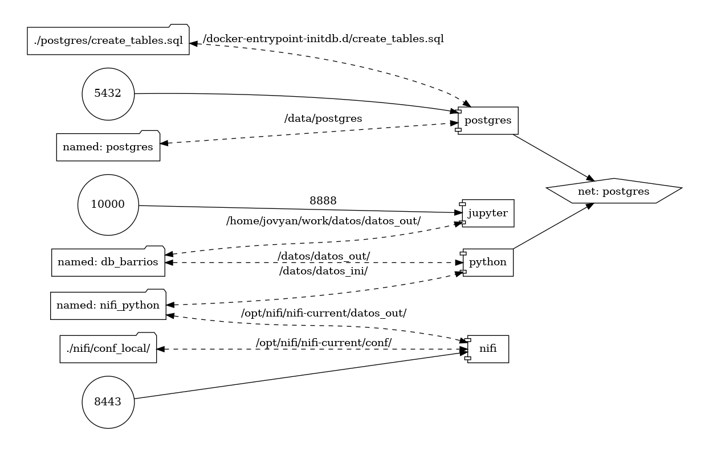

# DATA PROJECT 1

## Descripción

El portal lider de compra de vivienda en españa quiere sacar un piloto de calidad de vida aplicado a la vivienda y ha elegido Valencia como sede para su piloto. La idea de este piloto es ofrecer un mapa de calidad de la vivienda en funcion de indicadores de datos abiertos. La calidad de la vivienda se medirá por ruido, hospitales, contaminación… teniendo que dar una nota a una zona en concreto en base a dichos parámetros.

 

## Equipo

- [Fan Wu](https://www.linkedin.com/in/fan-wu-98697b13b/): Licenciado en ADE. Encargado de la parte de Business Inteligence y mejora de la aplicación para la incorporación de viviendas a la base de datos a través de Python y POSTRESQL

- [Dario Fernández](https://www.linkedin.com/in/dar%C3%ADo-fern%C3%A1ndez-fern%C3%A1ndez/): Economista. Encargado de la parte de Data Analytics diseñando la encuesta a realizar a los clientes y desarrollando el código para conexión a la API de Google a través de Python

- [Francisco Rosillo](https://www.linkedin.com/in/francisco-rosillo-d%C3%ADez/): Ingeniero de Telecomunicaciones. Parte del equipo de Data Engineering del proyecto. Desarrollo de código Python para carga de base de datos y creación de tablas en POSTGRESQL. También encargado de la parte de Calidad del Dato del proyecto.

- [Miguel Moratilla](https://github.com/mimove): Doctor en Ing. Aeroespacial. Encargado Senior del proyecto. Responsable de la extracción y transformación de los datos desde la web de [open data](https://valencia.opendatasoft.com/pages/home/). Diseño de la arquitectura, y dirección del proyecto distribuyendo tareas entre los componentes del equipo.

 

# Diseño de la arquitectura

El proyecto consta de 3 contenedores docker que se encargan de las 3 partes de Data Engineering (ETL) y un cuarto contenedor para realizar un estudio de calidad del dato:

1. Contenedor NiFi (Extracción): el contenedor NiFi se utiliza para la recolección de datos de la web de open data. NiFi se configura a través de un volumen bind mounted en el que se encuentra el flujo que tiene que ser ejecutado automáticamente cuando se levanta el contenedor. Este volumen se está alojado en ./nifi/conf_local. En total se descargan 9 archivos geojson con diferentes datos relativos a la calidad de vida de Valencia. Los archivos son compartidos con el contenedor Python a través de un volumen que se llama nifi_python. Los datos descargados son:

    - Zonas Verdes

    - Distribución de Hospitales

    - Distribución de colegios

    - Nivel de ruido

    - Limpieza

    - Puntos de recarga de coches eléctricos

    - Transporte público

2. Contenedor Python (Transformación): el contenedor Python se encarga de leer los archivos geojson que descarga NiFi, calcular la intersección del geoDataFrame de barrios con todos los geoDataFrame del resto de características, conectarse a la API de Google y calcular los barrios recomendados para los clientes en función de sus respuestas a la encuesta. Una vez hechas todas las transformaciones a los datos, el programa de Python se encarga también de cargar los datos en las tablas de la base de datos SQL. Las funciones creadas se han metido dentro de modulos para tener una estructura más organizada del código. El contenedor tiene 2 volumenes conectados: 

    - nifi_python: Volumen del que recoge los datos descargados por NiFi

    - db_barrios: Volumen en el que escribe el archivo final geojson con las características interpoladas a todos los barrios

3. Contenedor Postgres (Carga): el contenedor Postgres se utiliza como data warehouse para almacenar la base de datos del proyecto. Las tablas se crean desde un archivo .sql en tiempo de construcción del contenedor y son posteriormente alimentadas por Python.

4. Contenedor Jupyter (Calidad del dato): el contenedor docker se conecta a través del volumen db_barrios a python para poder acceder al archivo geojson y realizar un estudio de calidad del dato.

El diagrama con la arquitectura es el siguiente:

